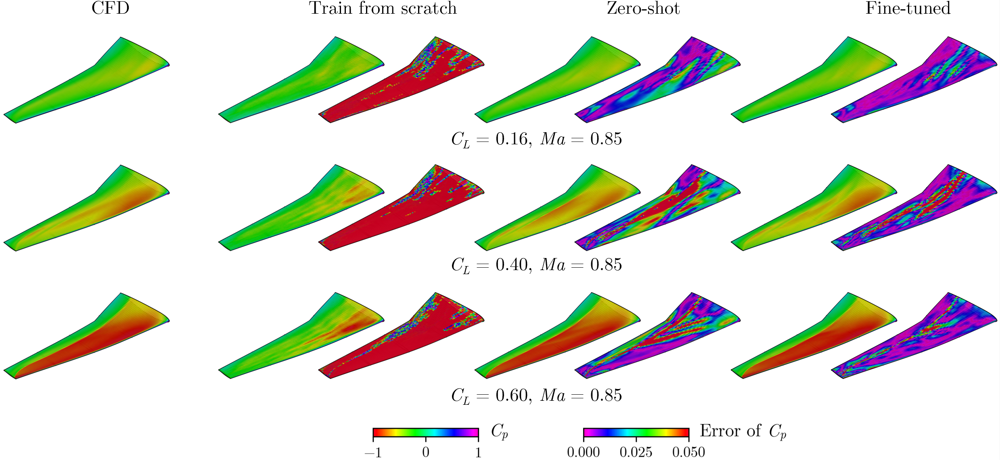
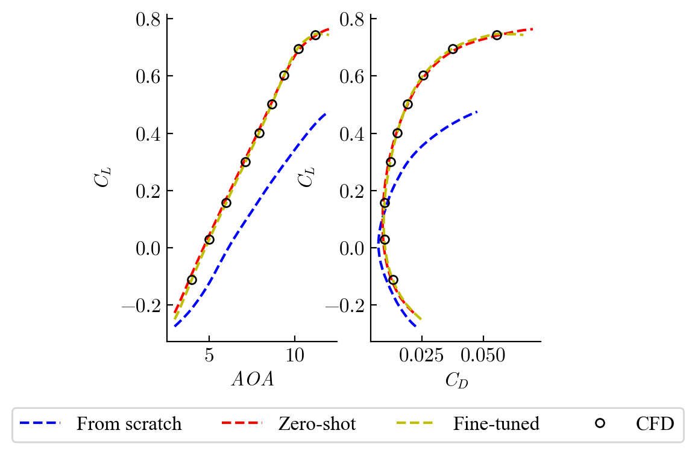
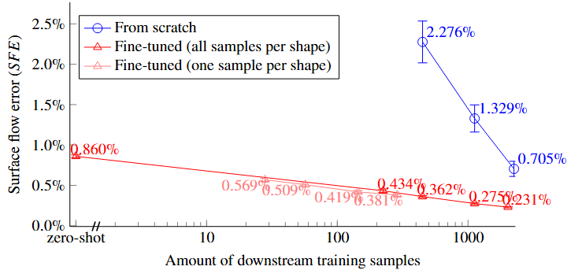

# Towards a Foundation-Model Paradigm for Aerodynamic Prediction in Three-dimensional Design

<div align="center">

[Paper]() •
[🤗 Hugging Face](https://huggingface.co/collections/thuerey-group)


[Yunjia Yang](https://yangyunjia.github.io/), [Babak Gholami](), [Caglar Gurbuz](), [Mohammad Rashed](), [Nils Thuerey](https://ge.in.tum.de/about/n-thuerey/)

</div>

---


This work introduces a **foundation-model style methodology** for efficiently constructing accurate surrogate models for **three-dimensional configurations**. It includes a two-stage strategy, which first pre-training a large-scale model on diverse geometries and then fine-tuning it with a few more detailed task-specific samples. A Transformer-based architecture, AeroTransformer, is developed and tailored for large-scale training to learn aerodynamics. 

We evaluated the method on *transonic wings*, where the model is pre-trained on [SuperWing](https://huggingface.co/datasets/yunplus/SuperWing) (including nearly 30000 samples with broad geometric diversity) and fine-tuned to handle specific wing shapes perturbed from the [Common Research Model](https://commonresearchmodel.larc.nasa.gov/). 


We observed: 

- pre-trained model learned the dominate aerodynamics, and perform well with very small task specific dataset (even zero-shot).

  <div align="center">
    
    
  </div>

- with 450 task-specific samples, the proposed methodology achieves 0.36\% error on surface-flow prediction (**1.2% error in $\bm {C_D}$**), reducing 84.2\% compared to training from scratch.

  <div align="center">
    
  </div>


We also studied the influence of model configurations and training strategies to provide guidance on effectively training and deploying such models under limited data and computational budgets.


## Resources Overview
- Paper

- Dataset collection:  
  - SuperWing (Pre-training dataset)        
    [https://huggingface.co/datasets/yunplus/SuperWing](https://huggingface.co/datasets/yunplus/SuperWing)
  - CRMpert (Task-specfic fine-tuning dataset)
  [https://huggingface.co/datasets/thuerey-group/CRMpert](https://huggingface.co/datasets/thuerey-group/CRMpert)
- Model hyperparameter collection (Pre-trained and fine-tuned):  
  [https://huggingface.co/thuerey-group/AeroTransformer](https://huggingface.co/thuerey-group/AeroTransformer)
- Implementation dependency:  
  - Model implementation (`FloGen` repo)
    [https://github.com/YangYunjia/floGen](https://github.com/YangYunjia/floGen)
  - Wing postprocess and visualazation (`cfdpost` repo) 
    [https://github.com/YangYunjia/cfdpost](https://github.com/YangYunjia/cfdpost)
- Training and simulation source code (here)
- `WebWing` Online interactive wing design tool:
    - Online version: [https://webwing.pbs.cit.tum.de/](https://webwing.pbs.cit.tum.de/)
    - Source code: [https://github.com/YangYunjia/webwing](https://github.com/YangYunjia/webwing)


## Repository Scope
 
This repo is intentionally focused on **training source code** and **simulation-related scripts** for the AeroTransformer project.


```text
AeroTransformer/
├── training/
│   ├── pretrain.py      # pre-train AeroTransformer
│   ├── finetune.py      # fine-tune a pretrained model on downstream task data
│   └── postprocess.py   # evaluate field/coefficient errors
├── simulation/
│   ├── gen-mesh.crmpert.py      # surface + volumetric mesh generation for CRMpert dataset
│   ├── gen-mesh.superwing.py    # surface + volumetric mesh generation for SuperWing dataset
│   ├── original_tip.xyz  # tempelate wing tip shape and mesh
│   ├── run-adflow.py     # calling the pyADflow solver
│   └── single-point.py   # main function for simulating single/multiple samples for one shape
├── LICENSE
└── readme.md
```

## Environment Setup

> Simulation part requires [MDO Lab](https://mdolab-mach-aero.readthedocs-hosted.com/en/latest/installInstructions/dockerInstructions.html) docker image (at least with `ADflow`, `pyHyp`, `cgnsutilities`)


## Citation


## License

This repository is released under the license provided in `LICENSE`.
